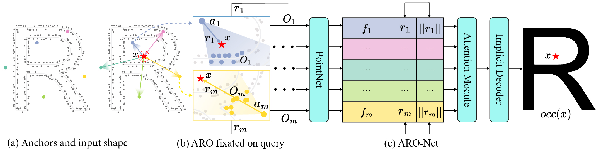

# ARO-Net

This is the official Pytorch implementation of the paper:

ARO-Net: Learning Implicit Fields from Anchored Radial Observations. CVPR. 2023.

Yizhi Wang*, Zeyu Huang*, Ariel Shamir, Hui Huang, Hao Zhang, Ruizhen Hu.

Paper: [arxiv](https://arxiv.org/abs/2212.10275)
Homepage: [ARO-Net](https://aro-net.github.io/)
Video: [Youtube](https://www.youtube.com/watch?v=RVoOkgbi9lk&t=5s)




## Setup

To setup a conda environment, and build dependencies:
```
# create conda environment for ARO-Net
conda create -n aro-net python=3.9 pytorch-gpu -c conda-forge
conda activate aro-net
pip install trimesh open3d tensorboard Cython

# install tools from ConvONet
python setup.py build_ext --inplace

# install LFD metrics
git clone https://github.com/kacperkan/light-field-distance
cd light-field-distance
python setup.py install
```

## Dataset

The dataset (~20GB) used in our experiments can be found in [OneDrive](https://1drv.ms/u/s!AkDQSKsmQQCghcQfKvYspGIW031LeA?e=NDzEi6) and [Baidu Disk](https://pan.baidu.com/s/1xHF79UFiHZJjx9J44V4lYA) (Password: so9v).

It contains ABC dataset (the first Chunk), and ShapeNet (Chairs and Airplanes).

The layout of ``data`` dir is: 

```
ARO-Net
├── data
│   ├── abc
    │   │   │──00_meshes
    │   │   │──01_pcds
    │   │   │──02_qry_pts
    │   │   │──03_qry_dists
    │   │   │──04_splits        
    ├── shapenet
    │   │   │──00_meshes
    │   │   │   │──02691156
    │   │   │   │──03001627      
    │   │   │──01_pcds
    │   │   │──02_qry_pts
    │   │   │──03_qry_dists
    │   │   │──04_splits            
    ├── anchors
```
### Customize Your Own Dataset

We followed the [script](https://github.com/ErlerPhilipp/points2surf/blob/2af6e0facf58422ed12e0c676c70199cd0dfbb43/make_dataset.py#L406C24-L406C46) in [Points2Surf]((https://github.com/ErlerPhilipp/points2surf)) to sample `qry_pts` and calculate their `signed distance`. Note that we did not use their way of normalization, our way of normalization can be found in this [link](https://github.com/yizhiwang96/ARO-Net/blob/main/data_processing/norm_and_sample_mesh.py), where the length of body diagonal of 3D bounding box is normalized to 1.

## Quick Testing

We provide pre-trained models on ABC dataset (first chunk) and ShapeNet (chairs):

- ABC: [OneDrive](https://1drv.ms/f/s!AkDQSKsmQQCghcNfVnUQWiaw5mY59Q?e=xa5cZ9) or [Baidu Disk](https://pan.baidu.com/s/1qiVKt7SvXIoKBfQJEv2Z1g) (Password: hcwk).
- ShapeNet: [Onedrive](https://1drv.ms/f/s!AkDQSKsmQQCghcNggvV_2b0kuexCaw?e=gjAOHj) or [Baidu Disk](https://pan.baidu.com/s/14CzMY_Q8DF8xXZbfOVw9JA) (Password: x6cj).

Put them under the folder `experiments`. For ShapeNet dataset, we trained ARO-Net on two kinds of query-occupancy ground-truth provied by [IM-Net](https://github.com/czq142857/IM-NET-pytorch) and [OCC-Net](https://github.com/autonomousvision/occupancy_networks), respectively.

To test our pretrained models,
```
# ABC
python reconstruct.py --name_exp pretrained_abc --name_ckpt aronet_abc.ckpt --name_dataset abc --use_dist_hit --n_pts_test 2048

# ShapeNet Chair (trained w/ IM-Net data)
python reconstruct.py --name_exp pretrained_chairs --name_ckpt aronet_chairs_gt_imnet.ckpt --name_dataset shapenet --categories_test 03001627, --use_dist_hit --n_pts_test 2048 --mc_threshold 0.5

# ShapeNet Chair (trained w/ OCC-Net data)
python reconstruct.py --name_exp pretrained_chairs --name_ckpt aronet_chairs_gt_occnet.ckpt --name_dataset shapenet --categories_test 03001627, --norm_coord --n_pts_test 2048 --mc_threshold 0.2

# ShapeNet Airplane (trained w/ IM-Net data)
python reconstruct.py --name_exp pretrained_chairs --name_ckpt aronet_chairs_gt_imnet.ckpt --name_dataset shapenet --categories_test 02691156, --use_dist_hit --n_pts_test 2048 --mc_threshold 0.5

# ShapeNet Airplane (trained w/ OCC-Net data)
python reconstruct.py --name_exp pretrained_chairs --name_ckpt aronet_chairs_gt_occnet.ckpt --name_dataset shapenet --categories_test 02691156, --norm_coord --n_pts_test 2048 --mc_threshold 0.2

```
You can also modify `--n_pts_test` to set the input of points of objects, we pre-sampled `1024` and `2048` points from meshes for testing.

## Training

We use Fibonacci sampling to generate 48 anchors for our ARO-Net. Other anchor settings can generated with `gen_anc.py`.

To train ARO-Net on ABC dataset or ShapeNet:
```
python train.py --name_exp base_model_abc --name_dataset abc --use_dist_hit --norm_coord
python train.py --name_exp base_model_chairs --name_dataset shapenet --categories_train 03001627, --norm_coord --gt_source occnet
```
It is recommended to set `use_dist_hit` to `True` when training on abc dataset or shapenet (im-net gt) (an auxiliary loss to predict anchor-query to surface distance) when training (it will bring some marginal performance gain). To use this auxiliary loss, first run `cal_hit_dist.py`.

To train ARO-Net on single shape with data augmentation:
```
python train.py --name_exp base_model --name_dataset single --name_single fertility
```

Check all training options in `options.py`. You need one NVIDIA A100 (80G) to train ARO-Net under the configurations in `options.py`. You can set the `n_bs` and `n_qry` to fit to your GPU capacity. set `n_bs` to `4` and `n_qry` to `256` will cost ~20GB video memory.

## Evaluation

To reconstruct meshes on test sets:
```
# ABC
python reconstruct.py --name_exp base_model_abc --name_ckpt 600_301101_xxx_xxx.ckpt --name_dataset abc --use_dist_hit

# ShapeNet Chair
python reconstruct.py --name_exp base_model_chairs --name_ckpt 600_301101_xxx_xxx.ckpt --name_dataset shapenet --categories_test 03001627, --norm_coord

# ShapeNet Airplane
python reconstruct.py --name_exp base_model_chairs --name_ckpt 600_301101_xxx_xxx.ckpt --name_dataset shapenet --name_dataset 02691156, --norm_coord
```

To evalute HD, CD, and IoU:
```
# ABC
python eval_metrics.py --name_exp base_model_abc --name_dataset abc

# ShapeNet
python eval_metrics.py --name_exp base_model_chairs --name_dataset shapenet --categories_test 03001627,
python eval_metrics.py --name_exp base_model_chairs --name_dataset shapenet --categories_test 02691156,
```

To evaluate LDF:
```
# ABC
python eval_lfd.py --name_exp 202203014_pretrained --name_dataset abc
```
We use [light-field-distance](https://github.com/kacperkan/light-field-distance) to compute LDF. The implementation of this library prevents us from computing this metric in parallel. It also requires an OpenGL context, so a pyhsical display is recommended. 


## Acknowledgement

[IM-Net](https://github.com/czq142857/IM-NET-pytorch)

[Occ-Net](https://github.com/autonomousvision/occupancy_networks)

[ConvONet](https://pengsongyou.github.io/conv_onet)

[Points2Surf](https://github.com/ErlerPhilipp/points2surf)

[light-field-distance](https://github.com/kacperkan/light-field-distance)

